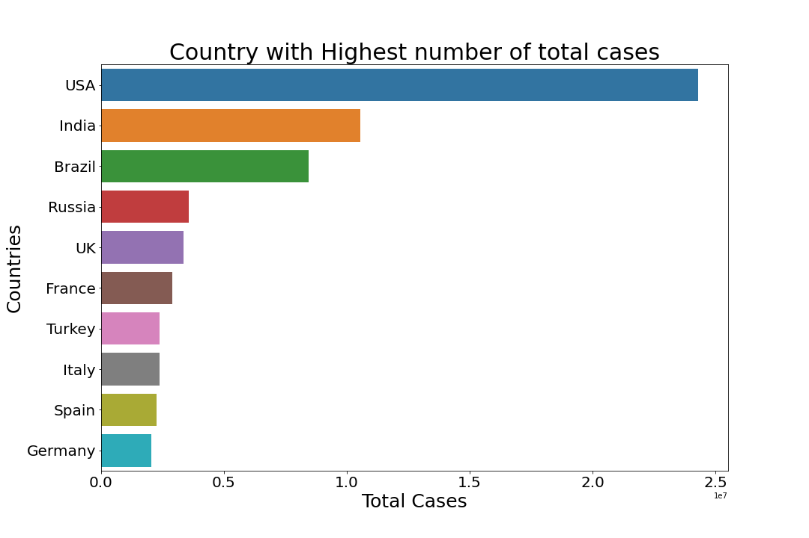
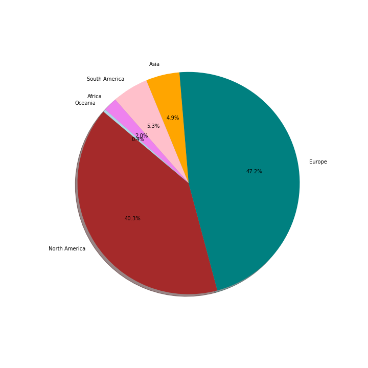
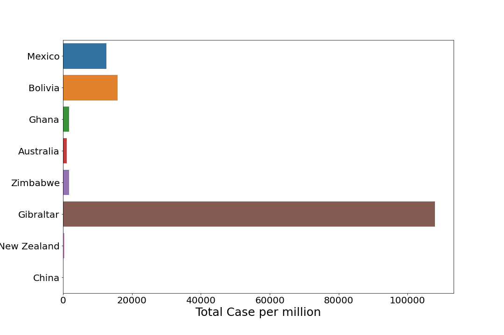
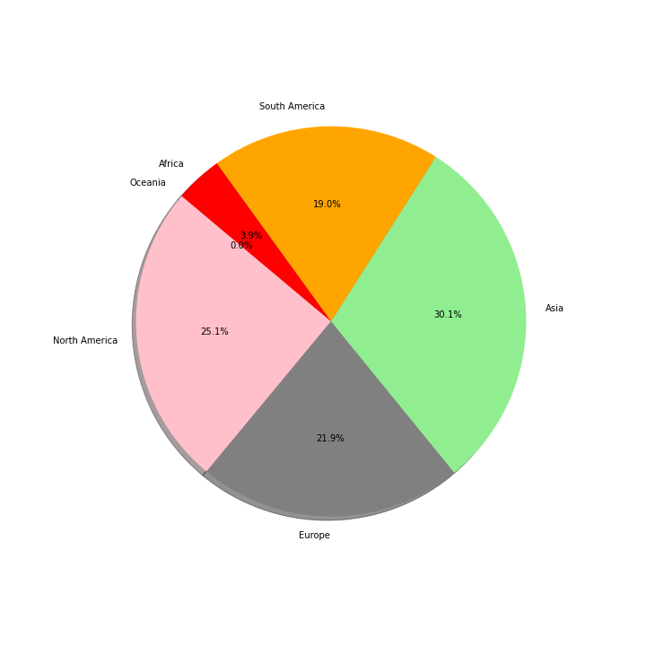

# Corona_Worldometer_DataSet
* Overview
* EDA Snapshots
* Technical tools
* Credits

# Overview
This is the dataset provided by DeepMindCreations with a aim to scrap the data from the officai site of worldometers https://www.worldometers.info/coronavirus/#countries. The data is parsed in the form of table using BeautifulSoup library to parse the html dataset. Similarly, further the data are cleaned by removing some punctuations so that our data will be free from errors and later visualized with Exploratory Data Analysis (Data Visualization).

# EDA Snapshots
*Some snapshots of the data visualization from the notebook.
>> Top most corona affected countries with total number of cases

>> Activate cases of corona Continent wise

>> Total cases per million population

>> Total recovered case Continent wise

# Technical Tools
>> Jupyter Notebook

>> Beaautiful Soup

>> Python

# Credits
All thanks and credit goes to DeepMindCreations for providing and giving me chance to explore the datasets.

### SantoshThapa 2021
